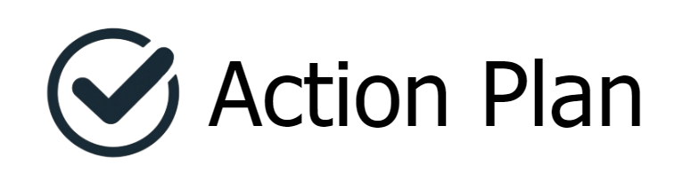
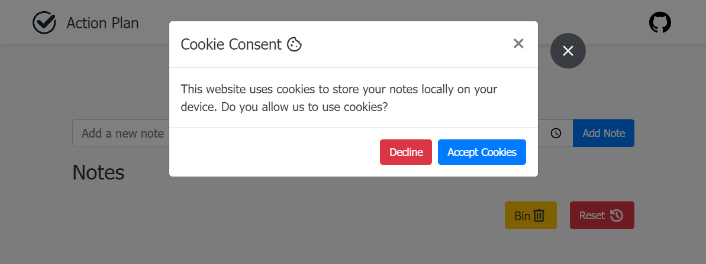
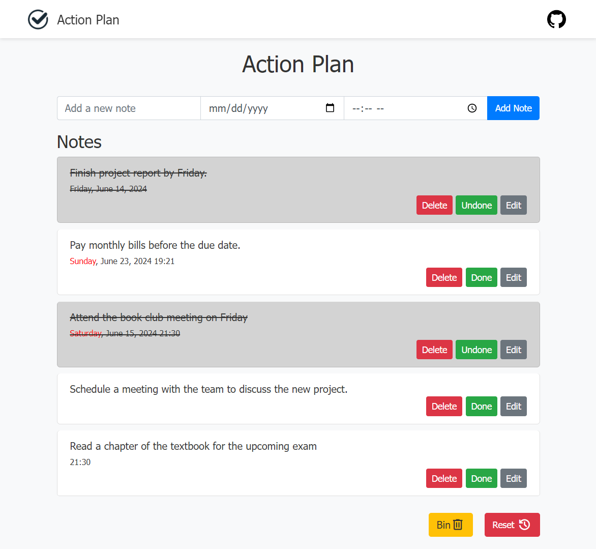
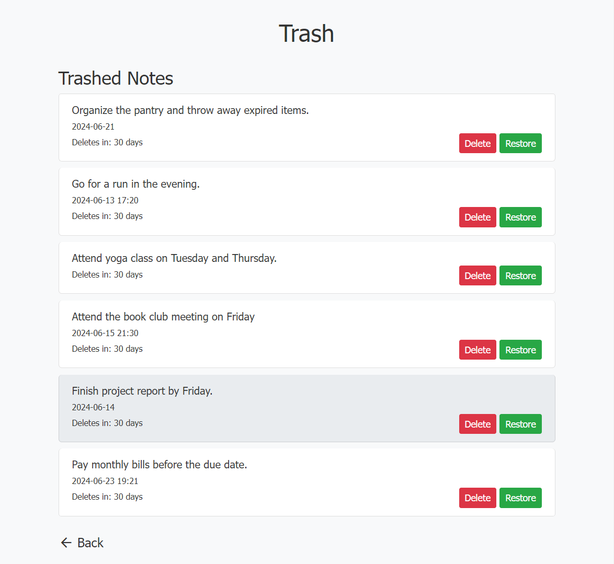
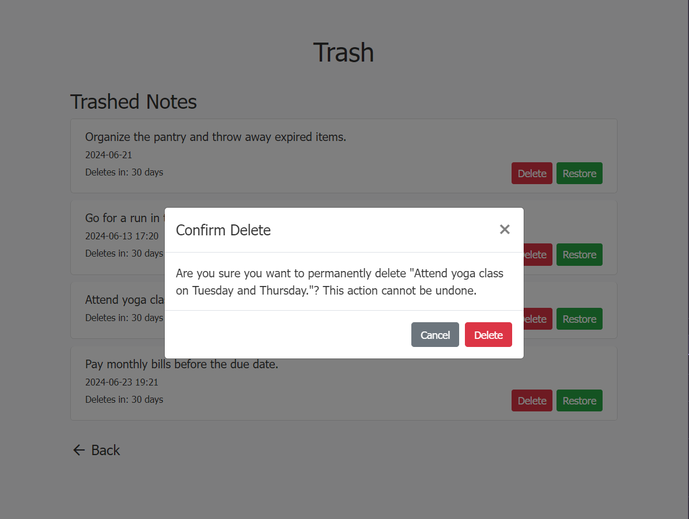
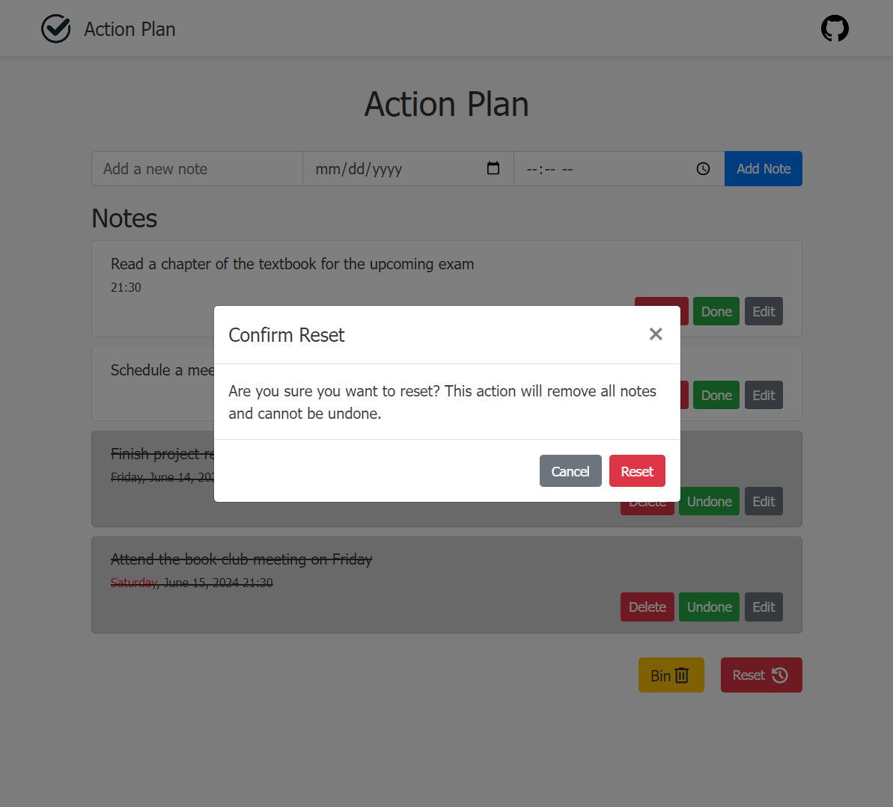

# Action Plan
[![Apache 2.0 License][license-shield]][license-url]
[![LinkedIn][linkedin-shield]][linkedin-url]

The Action Plan App is a sophisticated tool designed to help users organize their tasks efficiently. With a sleek and intuitive interface, this app empowers users to create, edit, and manage their action plans effortlessly.



## Features

1. **Add Notes**: Users can add new notes with a title, description, date, and time.
2. **Edit Notes**: Users can edit existing notes to update the content, date, or time.
3. **Trash Bin**: Deleted notes are moved to the trash bin and can be restored or permanently deleted from there.
4. **Restore Notes**: Users can restore notes from the trash bin back to the main notes list.
5. **Permanently Delete Notes**: Notes in the trash bin can be permanently deleted.
6. **Reset**: Option to reset the app, clearing all notes and settings.

## UI






## Technologies Used

- HTML
- CSS (Bootstrap for styling)
- JavaScript (jQuery for enhanced functionality)
- Sortable JS (For drag-and-drop functionality)
- Popper JS (For positioning tooltips and popovers)
- Toastify JS (For toast notifications)

## Getting Started

1. Clone the repository:

   ```bash
   git clone https://github.com/iam-baivab/Action-Plan.git
   ```

2. Open `index.html` in your preferred web browser to start using the app.

## Usage

1. **Adding Notes**:
   - Enter a title, description, date, and time for your note.
   - Click "Add Note" to add the note to your action plan.

2. **Editing Notes**:
   - Click on a note to edit its content, date, or time.

3. **Deleting Notes**:
   - Move unwanted notes to the trash bin by clicking on the delete icon.
   - Notes in the trash bin can be restored or permanently deleted.

4. **Resetting the App**:
   - Click the "Reset" button to clear all notes and start fresh.

## Contributing

Contributions to this project are welcome! To contribute, follow these steps:

1. Fork the repository.
2. Create a new branch (`git checkout -b feature/my-feature`).
3. Make your changes and commit them (`git commit -am 'Add new feature'`).
4. Push to the branch (`git push origin feature/my-feature`).
5. Create a new Pull Request.

Please ensure your code adheres to the existing code style and conventions.

## License

This project is licensed under the [Apache License 2.0](LICENSE).

[license-shield]: https://img.shields.io/badge/License-Apache%202.0-red.svg
[license-url]: https://github.com/iam-baivab/News-Scraping-using-BeautyfulSoup-Selenium-with-Django/blob/main/LICENSE
[linkedin-shield]: https://img.shields.io/badge/-LinkedIn-black.svg?style=flat&logo=linkedin&colorB=blue
[linkedin-url]: https://www.linkedin.com/in/baivabsarkar/